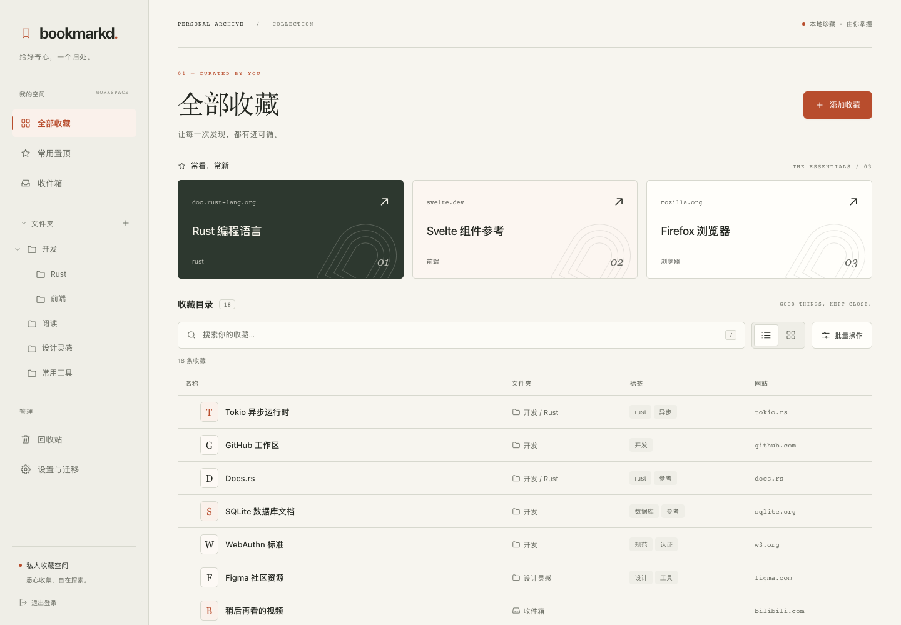

# bookmarkd · Private bookmark hub

[简体中文](README.md) · [Design](private_bookmark_hub_project_design.md) · [Lightweight systemd deployment (中文)](docs/DEPLOY_SYSTEMD.zh-CN.md) · [Operations](docs/OPERATIONS.md) · [Authentication](docs/AUTH.md) · [Validation report](docs/TESTING.md)

[](https://github.com/zhangchaosd/bookmarkd/actions/workflows/ci.yml)
[](https://github.com/zhangchaosd/bookmarkd/actions/workflows/release.yml)

Your bookmarks, independent of your browser. A self-hosted, single-user web app with a Rust backend, a Chinese Svelte interface, local SQLite databases, and embedded frontend assets. No Node.js runtime, external database, CDN, or authentication server is required to run it.




An editorial personal archive with warm paper, terracotta accents, and Chinese serif typography. Up to three pinned bookmarks appear in the essentials shelf, editable there and not repeated in the list below. Switch between list and card views, remembered on each device. List rows are 52px by default (room for one line of notes) or 36px without notes in compact mode. The layout adapts to phones; batch actions use the list layout. Screenshots show isolated test data.

## Features

- **Passkey-only authentication:** one login button, optional absolute 30-day sessions, terminal-authorized setup and recovery; no password fallback.
- **Bookmark management:** notes, nested folders, tags, pins, ordering, batch actions, and recoverable trash.
- **Search and access:** Chinese substrings, case-insensitive English and multiword AND queries, folder/tag filters, mobile layout, light/dark themes.
- **Data integrity:** optimistic versions, preserved edit inputs on conflicts, transactional batch writes, idempotent create/import, refresh on window focus.
- **Migration and operations:** HTML/JSON import preview, exports, capture bookmarklet, SQLite online backups and offline restores.
- **Reusable authentication:** embedded Rust crate with shared local authoritative credentials and separate host-scoped sessions; no SSO.

Manage folders directly in the sidebar: select ＋ next to “文件夹” to create one; hover a folder and select ⋯, or right-click it, to add a subfolder, rename, or delete. Deleting asks whether to keep its bookmarks (moved to Inbox) or move them to trash as well. Folders with children can be collapsed. Press `/` to focus search.

On desktop, drag a bookmark's left handle to another row's upper/lower edge to reorder, onto a sidebar folder to move it inside, or onto Inbox to move it out. Folders can also be dragged: the center nests them, the edges reorder siblings, and dropping on the “文件夹” heading (shown as “移至根目录” while dragging) moves them to the root. Changes save automatically. Clear search/tag filters before reordering; moving into folders remains available while filtered. On touch devices, use editing and batch moves.

Choose Terracotta (default), Forest, Ocean, Iris, Amber, or Graphite under Settings → Browsing preferences. Each palette supports light, dark, and system appearance. Preview immediately, then select Save preferences to persist the choice.

## Download and run

Download from [Releases](https://github.com/zhangchaosd/bookmarkd/releases) and verify `SHA256SUMS`. Each artifact includes a native startup and dynamic dependency manifest.

| Platform | Artifact |
|---|---|
| Linux x86_64 / aarch64 | `bookmarkd-linux-x86_64` / `bookmarkd-linux-aarch64` |
| macOS Apple Silicon / Intel | `bookmarkd-macos-arm64` / `bookmarkd-macos-x86_64` |
| Windows x86_64 | `bookmarkd-windows-x86_64.exe` |

Linux builds use glibc from Ubuntu 24.04, not static musl. macOS and Windows binaries are unsigned. Platform support is limited to the actual evidence in release manifests.

```sh
# Rename the downloaded Linux/macOS artifact to bookmarkd first
chmod +x bookmarkd
./bookmarkd init --data-dir ./data \
  --public-url https://bookmark.example.com --rp-id example.com --setup-mode auto
./bookmarkd --config ./data/config.toml serve
# Run in a separate administrator terminal:
./bookmarkd --config ./data/config.toml auth create-setup-token
```

Point an HTTPS reverse proxy at `127.0.0.1:8765`, preserving the public Host header. Open `/setup`, enter the terminal token, create a Passkey, then log in explicitly. Set `setup_mode = "disabled"` in `data/config.toml` and restart. **Issuing a token never overrides disabled mode.**

On Windows, run `.\bookmarkd-windows-x86_64.exe` in PowerShell and skip `chmod`.

For local development only:

```sh
./bookmarkd init --data-dir ./local-data \
  --public-url http://localhost:8765 --rp-id localhost --allow-insecure-localhost
./bookmarkd --config ./local-data/config.toml serve
# Separate terminal:
./bookmarkd --config ./local-data/config.toml auth create-setup-token
```

Use `http://localhost:8765` exactly; `127.0.0.1` is a different origin.

## Checking for and installing updates

Settings → “版本与更新” shows the current version, checks GitHub Releases on demand, and can check automatically every day or every week at a fixed server-local time. The channel is either prereleases included (default; every release so far is a prerelease) or stable only. Automatic checks are off by default; when enabled, the server contacts `api.github.com`.

Scheduled checks **only notify**: a red dot appears on “设置与迁移”. Installing requires selecting “更新到 vX” and a fresh Passkey verification. The server then downloads this platform's file, verifies it against the same release's `SHA256SUMS`, runs the new binary's `version` self-check, backs up data to `data/backups/pre-update-*`, swaps the executable (keeping the previous one as `bookmarkd.old`), and restarts in place (same PID, so systemd needs no extra configuration). The executable's directory must be writable by the service user.

`SHA256SUMS` detects corrupted downloads but cannot protect against a replaced release. Windows is check-only and links to the download. v0.3.0 and earlier lack this feature and need one manual upgrade.

```sh
./bookmarkd --config ./data/config.toml update check
./bookmarkd --config ./data/config.toml update install --yes   # then restart the service
./bookmarkd --config ./data/config.toml update rollback --yes  # swap back to bookmarkd.old, then restart
```

## Build from source

Requires Rust 1.94.0 (pinned via rustup), Node.js 24, a C toolchain, and Perl. Windows builds also need NASM. SQLite and OpenSSL are bundled/vendored.

```sh
npm ci --prefix web
npm run check --prefix web
npm run build --prefix web
cargo build --locked --release
# target/release/bookmarkd, or bookmarkd.exe on Windows
```

Build the frontend before Rust. Release binaries embed `web/dist`; deploying the web directory is unnecessary.

```sh
cargo fmt --all -- --check
cargo clippy --locked --workspace --all-targets -- -D warnings
cargo test --locked --workspace
cargo build --locked
cd web
npx playwright install chromium
npm test
```

Browser tests use a standard WebAuthn virtual authenticator without any production authentication bypass. They exercise registration, login, both cookie lifetimes, shared-host isolation, bookmark management, import/export, and revocation. See the [validation report](docs/TESTING.md) for real-device and performance limits.

## Automated builds and releases

Main-branch pushes and pull requests run frontend checks/build, Rust fmt/Clippy/tests, and browser integration tests. Push a version tag to publish:

```sh
git tag v0.1.0
git push origin v0.1.0
```

Tags matching `v*` trigger five native platform builds, tests, embedded-UI startup, backup/restore smoke tests, and an automatic GitHub **prerelease** containing executables, manifests, license notices, and SHA-256 checksums. Releases remain prereleases until real-device coverage and independent security review are complete. Manual workflow runs only produce Actions artifacts.

## Layout and boundaries

```text
crates/auth/       Embedded authentication and SQLite AuthStore
crates/bookmarkd/  CLI, configuration, business transactions, HTTP, asset embedding
web/              Svelte + TypeScript frontend and Playwright tests
docs/             Authentication, operations, validation and limitations
scripts/          Native artifact startup, restore and dependency checks
.github/workflows/ CI and five-platform releases
```

This version stores transactional business snapshots in SQLite; authentication uses separate normalized tables. The 50,000-entry import limit is not a claim that design performance targets have been met at that size. Optional metadata fetching, AI, public sharing, and multiple users are outside scope.

MIT licensed. See [third-party notices](docs/THIRD_PARTY.md).
