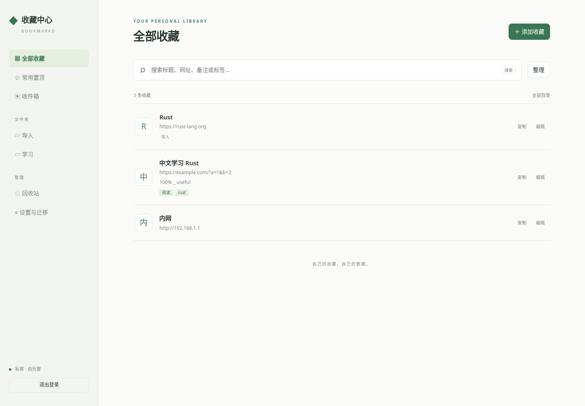

# bookmarkd · 私人收藏中心

[English](README.en.md) · [设计文档](private_bookmark_hub_project_design.md) · [systemd 生产部署](docs/DEPLOY_SYSTEMD.zh-CN.md) · [部署与恢复](docs/OPERATIONS.md) · [认证模块](docs/AUTH.md) · [验证报告](docs/TESTING.md)

[](https://github.com/zhangchaosd/bookmarkd/actions/workflows/ci.yml)
[](https://github.com/zhangchaosd/bookmarkd/actions/workflows/release.yml)

把收藏从浏览器中独立出来。一个自托管、单用户的收藏 Web 应用：Rust 服务端、Svelte 中文界面、SQLite 本地数据，前端嵌入可执行文件。运行无需 Node.js、外部数据库、CDN 或认证服务。




紧凑三列浏览：名称（含图标）、标签、网址；默认行高 32px，紧凑模式 28px。截图使用演示数据。

## 功能

- **仅 Passkey 登录**：极简登录页、可选 30 天绝对有效期；终端一次性令牌注册与恢复，无密码后门。
- **日常收藏**：网址、备注、多级文件夹、标签、置顶、排序、批量移动/标签/删除、回收站。
- **随时找回**：中文短词、英文大小写无关、多词 AND 搜索；手机布局、深浅主题、目录与标签筛选。
- **可靠操作**：版本冲突提示并保留输入、事务批量操作、幂等创建/导入、聚焦时检查更新。
- **迁移与运维**：HTML/JSON 导入预览及确认、业务导出、Bookmarklet、SQLite 在线备份和离线恢复。
- **可复用认证**：独立 Rust crate、本机权威凭据库共享，各宿主 Session 独立；不实现 SSO。

桌面端可拖动收藏行左侧手柄：拖到其他行的上沿或下沿调整顺序，拖到侧栏目录中移入，拖到「收件箱」移出目录。目录也可以拖动：中间区域用于嵌套，上下边缘用于同级排序，「移至根目录」用于移出上级目录。顺序自动保存；搜索或标签筛选时可移动目录归属，清除筛选后可排序。触屏端可使用编辑与批量移动。

配色可在「设置与迁移 → 浏览偏好」选择：森林绿、海洋蓝、鸢尾紫、暖琥珀、石墨灰。每组支持浅色、深色与跟随系统，即时预览后点击「保存偏好」持久保存。

## 下载与运行

从 [Releases](https://github.com/zhangchaosd/bookmarkd/releases) 下载对应文件，并对照 `SHA256SUMS` 校验。每个制品附平台启动测试和动态依赖清单。

| 平台 | 制品 |
|---|---|
| Linux x86_64 / aarch64 | `bookmarkd-linux-x86_64` / `bookmarkd-linux-aarch64` |
| macOS Apple Silicon / Intel | `bookmarkd-macos-arm64` / `bookmarkd-macos-x86_64` |
| Windows x86_64 | `bookmarkd-windows-x86_64.exe` |

Linux 使用 glibc（Ubuntu 24.04 构建），不是 musl 静态制品；macOS/Windows 未签名。仅声明清单实际测试的平台，不承诺全部旧版系统。

```sh
# Linux/macOS 下载后按实际文件名重命名，再授予执行权限
chmod +x bookmarkd
./bookmarkd init --data-dir ./data \
  --public-url https://bookmark.example.com --rp-id example.com --setup-mode auto
./bookmarkd --config ./data/config.toml serve
# 在另一个管理终端执行
./bookmarkd --config ./data/config.toml auth create-setup-token
```

将 HTTPS 反向代理指向 `127.0.0.1:8765`，保留原 Host。打开输出的 `/setup` 地址，输入终端令牌，创建 Passkey，再回到登录页验证。完成后把 `data/config.toml` 中 `setup_mode` 改为 `disabled` 并重启。**生成令牌不会绕过 disabled 模式。**

Windows 使用 PowerShell 执行 `.\bookmarkd-windows-x86_64.exe`，不需要 `chmod`。

本地体验（仅明确允许 localhost HTTP）：

```sh
./bookmarkd init --data-dir ./local-data \
  --public-url http://localhost:8765 --rp-id localhost --allow-insecure-localhost
./bookmarkd --config ./local-data/config.toml serve
./bookmarkd --config ./local-data/config.toml auth create-setup-token
```

最后一条命令在另一个终端执行。使用 `http://localhost:8765`，不要替换成 `127.0.0.1`，因为 Origin 必须精确匹配。

## 从源码构建

依赖：Rust 1.94.0（rustup 自动读取工具链文件）、Node.js 24、C 编译工具链及 Perl。Windows 构建还需 NASM。SQLite 和 OpenSSL 采用 bundled/vendored 构建。

```sh
npm ci --prefix web
npm run check --prefix web
npm run build --prefix web
cargo build --locked --release
# target/release/bookmarkd（Windows 为 bookmarkd.exe）
```

必须先构建前端，再编译 Rust。`cargo` 的 release 二进制包含 `web/dist`，部署不需要复制 web 目录。

```sh
cargo fmt --all -- --check
cargo clippy --locked --workspace --all-targets -- -D warnings
cargo test --locked --workspace
cargo build --locked
cd web
npx playwright install chromium
npm test
```

浏览器测试使用标准 WebAuthn 虚拟认证器，无生产认证绕过入口。覆盖首次注册、登录、两种 Cookie、共享宿主隔离、收藏操作、导入导出与撤销。实机兼容性和性能范围见 [验证报告](docs/TESTING.md)。

## 自动构建发布

`main` 提交和 Pull Request 执行类型检查、前端构建、fmt、Clippy、Rust 测试及浏览器端到端测试。

```sh
git tag v0.1.0
git push origin v0.1.0
```

`v*` 标签触发五个平台原生构建、测试、单文件启动及备份恢复检查，再自动创建 GitHub **预发布**，上传可执行文件、测试清单、许可证和 SHA-256 校验和。未完成实机认证器矩阵与独立安全审查前不自动标记为稳定版。手动运行 Release workflow 只生成 Actions artifacts。

## 项目结构

```text
crates/auth/       可嵌入认证模块与 SQLite AuthStore
crates/bookmarkd/  CLI、配置、业务事务、HTTP 和资源嵌入
web/              Svelte + TypeScript 界面与 Playwright 测试
docs/             认证边界、部署恢复、实测与限制
scripts/          原生制品启动、备份恢复和依赖检查
.github/workflows/ CI 与五平台自动发布
```

此版本使用 SQLite 中的事务化业务快照；认证使用独立规范化表。50,000 条导入上限不等于已证明该规模满足设计性能目标。未实现可选元数据抓取、AI、公开分享或多用户。

MIT License。依赖声明见 [THIRD_PARTY.md](docs/THIRD_PARTY.md)。
